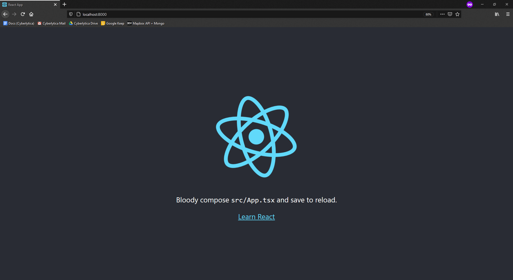

This project is intended to work through setting up a workflow with Docker. In particular, we will be setting up a production workflow for a web app. 

Find the full write up over at: <https://github.com/JackMcKew/jackmckew.dev/blob/drafts/drafts/2020/develop-and-deploy-with-docker/develop-and-deploy-with-docker.md>

| Technology                                  | Use                                                                          |
| ------------------------------------------- | ---------------------------------------------------------------------------- |
| Docker                                      | Docker will be used to containerization of the services inside our app       |
| Amazon Web Services (AWS) Elastic Beanstalk | Elastic Beanstalk will manage the deployment of our application              |
| React                                       | React is the front-end JavaScript framework that we will use                 |
| Express                                     | Express is responsible for the API between Redis, PostgreSQL and Vue         |
| Redis                                       | Redis will store/retrieve any local data used by our users                   |
| Nginx                                       | Nginx will handle the routing between our services                           |
| Github Actions                              | Github Actions will be our CI/CD platform for running tests before deploying |

Here's a screenshot of the application in the end:

